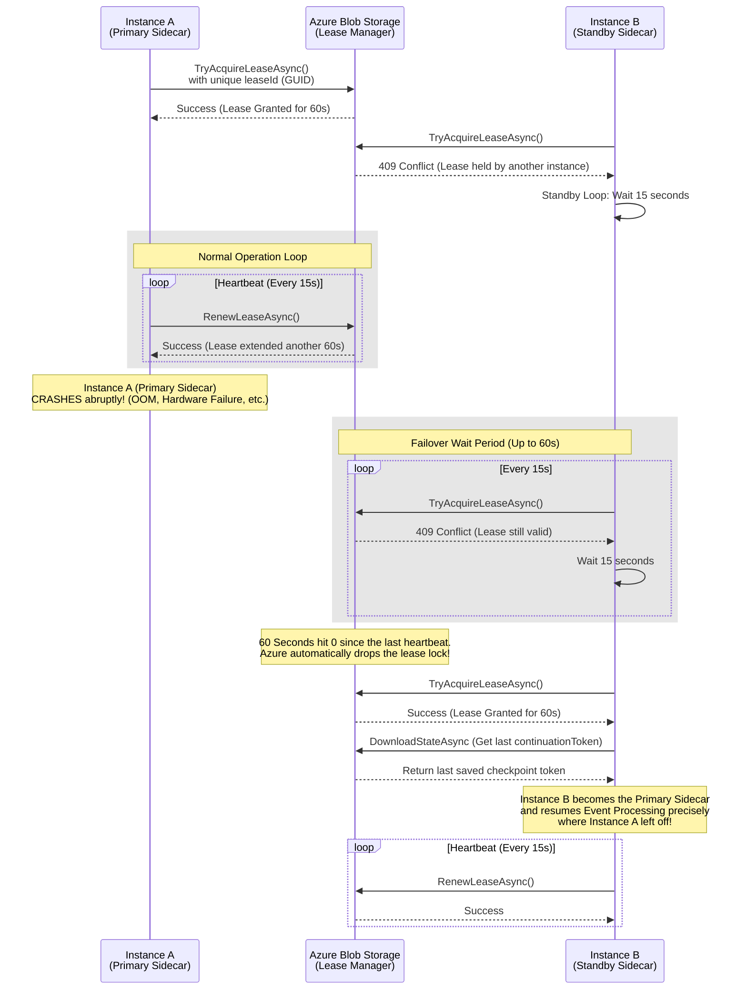

# Blob Change Feed Lease Pattern

This document explains how the [BlobChangeFeedProcessor](file:///media/carlos-quispe/Data/PROJECTS/Kubernetes/sidecar/EventManager.Sidecar/BlobChangeFeedProcessor.cs#19-132) uses distributed locking (via Azure Blob Leases) and checkpointing to ensure reliable, coordinated event processing across multiple sidecar instances.

## Core Concepts

1.  **Mutual Exclusion**: Only one sidecar instance (the "Lease Holder") can process the change feed at any given time.
2.  **Checkpointing**: The current `continuationToken` is saved periodically to the same blob that holds the lease.
3.  **Failover**: If the current Lease Holder crashes, the lease will eventually expire (60 seconds), allowing another sidecar instance to take over and resume from the last saved checkpoint.

## Sequence Diagram

## Key Implementation Details

-   **Instance Identity & Leasing**: We maintain two identities. The `HOSTNAME` environment variable (set by Kubernetes) is preserved as the `_instanceId` primarily for human-readable logging. However, the exact string passed as the `_leaseId` to Azure is ALWAYS a freshly generated GUID (`Guid.NewGuid().ToString()`), because Azure Blob Storage strictly requires lease IDs to be highly unique, RFC 4122 formatted GUIDs.
-   **Lock Visibility & Heartbeats**: The lock is **not** renewed between event batches. Instead, a dedicated background Task (`RunHeartbeatAsync`) wakes up every 15 seconds to unilaterally pulse `RenewLeaseAsync`. This completely decouples lock visibility from event processing latency!
-   **Safe Recovery & Tokens**: By downloading the `continuationToken` immediately after acquiring the lease, we ensure the new instance picks up the change feed feed where the crashed instance left off. If the checkpoint blob is perfectly empty/0 bytes (meaning the feed has never been ran), the application explicitly resets the token back to `null` to ensure the Azure SDK starts safely from the beginning without triggering a JSON Parsing (`JsonException`) failure.

---
*For implementation details, see [IBlobLeaseManager.cs](file:///media/carlos-quispe/Data/PROJECTS/Kubernetes/sidecar/EventManager.Sidecar/IBlobLeaseManager.cs) and [BlobChangeFeedProcessor.cs](file:///media/carlos-quispe/Data/PROJECTS/Kubernetes/sidecar/EventManager.Sidecar/BlobChangeFeedProcessor.cs).*
